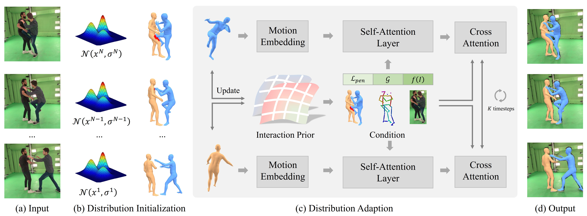

# \[CVPR2024\] Closely Interactive Human Reconstruction with Proxemics and Physics-Guided Adaption (CloseInt)

The code for CVPR 2024 paper "Closely Interactive Human Reconstruction with Proxemics and Physics-Guided Adaption"<br>
[Buzhen Huang](http://www.buzhenhuang.com/), [Chen Li](https://chaneyddtt.github.io/), [Chongyang Xu](https://openreview.net/profile?id=~Chongyang_Xu1), [Liang Pan](https://liangpan99.github.io/), [Yangang Wang](https://www.yangangwang.com/), [Gim Hee Lee](https://www.comp.nus.edu.sg/~leegh/)<br>
\[[Paper](https://arxiv.org/abs/2404.11291)\]



## Installation 
Create conda environment and install dependencies.
```
conda create -n closeint python=3.8
pip install torch==2.0.1 torchvision==0.15.2 torchaudio==2.0.2 --index-url https://download.pytorch.org/whl/cu118
pip install -r requirements.txt
```
You may also require [BVH_CUDA](https://github.com/vchoutas/torch-mesh-isect) for collision detection.

Download the official SMPL model from [SMPL](https://smpl.is.tue.mpg.de/) and [SMPLify website](http://smplify.is.tuebingen.mpg.de/) and place them in ```data/smpl```.<br>


## Training on Hi4D
**Step1:**<br>
Following other video-based methods, we extract image features as network input for training efficiency. The preprocessed annotations can be obtained from [Baidu Netdisk](https://pan.baidu.com/s/1s4NTmavBt40nLqGTTuo4gA?pwd=vcvf) or [Google Drive](https://drive.google.com/drive/folders/116o5XtyTsaCKCkHsX0oZxOxI462jJMGB?usp=sharing). You should also download original images from [Hi4D website](https://yifeiyin04.github.io/Hi4D/#dataset). The folder structure is shown as follows:
```
./data
├── dataset
│   ├── Hi4D
│   │   ├── annot
│   │   └── images
├── smpl
│   ├── SMPL_MALE.pkl
│   └── SMPL_FEMALE.pkl
│   └── SMPL_NEUTRAL.pkl
├── checkpoint.pkl
```

**Step2:**<br>
```bash
python train.py --config cfg_files/config.yaml
```

## Evaluation
**Step1:**<br>
Download checkpoint file from [Baidu Netdisk](https://pan.baidu.com/s/1TGs2Gb9C4qVlC_ScoLjgiA?pwd=tsrn) or [Google Drive](https://drive.google.com/file/d/1AJOqOUzDgiKPA3Q-E41GjNe3hSu0xcbt/view?usp=drive_link). You may also require [SDF loss](https://github.com/penincillin/SDF_ihmr) for evaluating penetration.

**Step2:**<br>
```bash
python eval.py --config cfg_files/eval.yaml
```

## Demo
Download ```demo_models``` from [Baidu Netdisk](https://pan.baidu.com/s/1RlyFa9UUmsm1-qH-zS-EOg?pwd=2wjs) and place them in ```data```. Then, compile roi_align from [Alphapose](https://github.com/MVIG-SJTU/AlphaPose).
```bash
python demo.py
```

## Citation
If you find this code useful for your research, please consider citing the paper.
```
@inproceedings{huanginteraction,
title={Closely Interactive Human Reconstruction with Proxemics and Physics-Guided Adaption},
author={Huang, Buzhen and Li, Chen and Xu, Chongyang and Pan, Liang and Wang, Yangang and Lee, Gim Hee},
booktitle={IEEE/CVF Conference on Computer Vision and Pattern Recognition},
year={2024}
}
```

## Acknowledgments
Some of the code are based on the following works. We gratefully appreciate the impact it has on our work.<br>
[InterGen](https://github.com/tr3e/InterGen)<br>
[SMPLX](https://github.com/vchoutas/smplx)<br>
